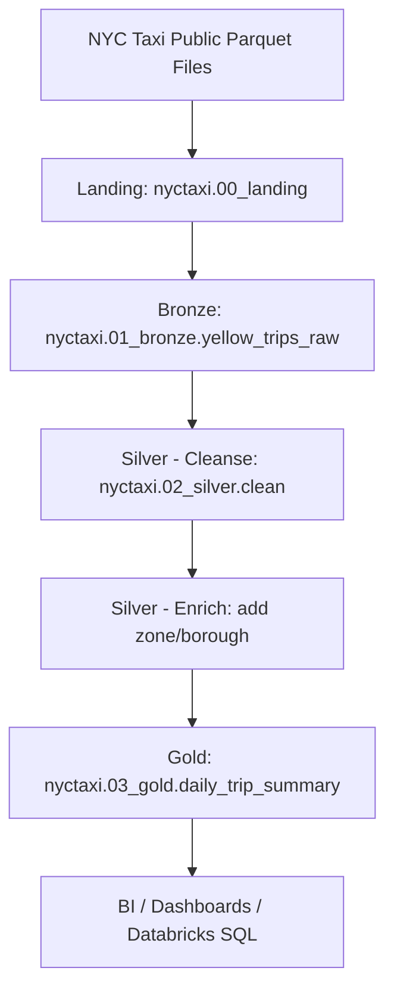

🚖 Databricks NYC Taxi Data Engineering Project
**End-to-end Data Engineering Pipeline** • Azure Databricks · PySpark · Delta Lake · Unity Catalog


## 📘 Table of Contents
- [Project Overview](#project-overview)
- [Project Summary (End-to-End Flow)](#project-summary-end-to-end-flow)
- [Architecture (Medallion)](#architecture-medallion)
- [Detailed Layer Descriptions](#detailed-layer-descriptions)
  - [1. Ingestion (Landing)](#1-ingestion-landing)
  - [2. Bronze Layer (Raw + Metadata)](#2-bronze-layer-raw--metadata)
  - [3. Silver Layer (Cleansed + Enriched)](#3-silver-layer-cleansed--enriched)
    - [Silver — Cleanse Notebook](#silver--cleanse-notebook)
    - [Silver — Enrich Notebook](#silver--enrich-notebook)
  - [4. Gold Layer (Analytics-ready)](#4-gold-layer-analytics-ready)
- [Taxi Zone Lookup Handling](#taxi-zone-lookup-handling)
- [Repository Structure](#repository-structure)
- [How to Run (Step-by-step)](#how-to-run-step-by-step)
- [Example Outputs & Sample Queries](#example-outputs--sample-queries)
- [Resume Snippet & Interview Pitch](#resume-snippet--interview-pitch)
- [Future Enhancements](#future-enhancements)
- [Tech Stack](#tech-stack)
- [Contact](#contact)
- [License](#license)

---

## Project Overview

This repository contains an **end-to-end data engineering pipeline** implemented in **Azure Databricks**.  
It ingests NYC Yellow Taxi public trip data (published by NYC TLC) and processes it using the **Medallion Architecture** (Landing → Bronze → Silver → Gold). The pipeline is built to handle the real-world constraint that the NYC TLC publishes datasets with a **two-month delay** (e.g., in November the most recent dataset available is September).

The pipeline produces an analytics-ready gold table `nyctaxi.03_gold.daily_trip_summary` that can be used for dashboards and reporting.

---

## Project Summary (End-to-End Flow)

1. **Ingestion Notebook**: Automatically computes the two-month-prior dataset (e.g., run in November → ingest September), reads the Parquet file, and writes it to the Landing area in Unity Catalog (`nyctaxi.00_landing`).
2. **Bronze Layer**: Reads from landing, adds `processed_timestamp`, and appends raw records to `nyctaxi.01_bronze.yellow_trips_raw`.
3. **Silver Layer**: Two notebooks — **Cleanse** (data quality, schema fixes) and **Enrich** (join with taxi zone lookup to add borough/zone names). Writes output to `nyctaxi.02_silver`.
4. **Gold Layer**: Aggregates cleansed & enriched records into `nyctaxi.03_gold.daily_trip_summary` containing daily business metrics.
5. **Lookup Management**: The pipeline checks the Taxi Zone Lookup CSV for updates and reloads/updates the lookup data if changed.

---

## Architecture (Medallion)



---

## Detailed Layer Descriptions

### 1. Ingestion (Landing)
**Purpose:** Fetch the correct Parquet file (two months prior) published by NYC TLC and store it in the landing area.

**Key Steps implemented:**
- Compute two-month-prior year-month (e.g., `2025-09` when running in Nov 2025).
- Construct the public file path / URL for the Parquet file.
- Read Parquet into a Spark DataFrame.
- Persist raw data to Unity Catalog schema: `nyctaxi.00_landing`.
- Record ingestion metadata (file name, ingested_at timestamp).

**Why this matters:** The landing zone preserves the original raw data as-is and isolates ingestion concerns from downstream transformations.

---

### 2. Bronze Layer (Raw + Metadata)
**Purpose:** Store raw data with minimal processing and metadata for traceability.

**Key Steps implemented:**
- Load data from `nyctaxi.00_landing`.
- Add a `processed_timestamp` column using `current_timestamp()` to mark when the pipeline processed the file.
- Append transformed rows into `nyctaxi.01_bronze.yellow_trips_raw` (Delta table in Unity Catalog).
- Keep schema flexible enough to capture raw fields but enforce minimal constraints helpful for downstream processing.

**Why this matters:** Bronze is the single source of truth for raw historical data and supports reprocessing / auditing.

---

### 3. Silver Layer (Cleansed + Enriched)
The Silver layer is intentionally split into two notebooks (Cleanse and Enrich) to separate concerns.

#### Silver — Cleanse Notebook
**Purpose:** Improve data quality and enforce schema correctness.

**Operations performed:**
- Filter or fix corrupted rows and null anomalies.
- Enforce data types (cast columns to correct types: timestamps, integers, floats).
- Validate and filter unrealistic trips (e.g., negative distances, zero or negative fares).
- Normalize columns where needed.

**Output:** intermediate cleaned DataFrame stored under `nyctaxi.02_silver` (e.g., `yellow_trips_clean`).

#### Silver — Enrich Notebook
**Purpose:** Enrich cleansed trips with human-friendly location information.

**Operations performed:**
- Load and validate taxi zone lookup CSV (location id → zone name, borough).
- Detect changes in the lookup CSV (file checksum or modification timestamp).
- If lookup changed, update the reference table used for enrichments.
- Join cleansed trips with the lookup to add `pickup_borough`, `pickup_zone`, `dropoff_borough`, `dropoff_zone`.
- Ensure enriched rows are written to `nyctaxi.02_silver` (enriched dataset).

**Why this matters:** Enrichment turns raw IDs into readable, analyzable dimensions required for business metrics.

---

### 4. Gold Layer (Analytics-ready)
**Purpose:** Produce business-focused aggregated tables for analysis and dashboards.

**Primary Output:**
- `nyctaxi.03_gold.daily_trip_summary`

**Aggregations / Metrics included:**
- `date` (day)  
- `total_trips`  
- `total_revenue` (sum of fare_amount + additional charges where applicable)  
- `avg_fare_amount`  
- `avg_trip_duration`  
- `total_passengers`  
- `top_pickup_zones` (top-N per day)  

**Example use cases:** feeding Databricks SQL dashboards, Power BI reports, or ad-hoc analytics queries.

---

## Taxi Zone Lookup Handling

The project uses the official Taxi Zone Lookup CSV to map `location_id` values to human-readable `zone` and `borough`. The pipeline includes logic to:

- Check whether the lookup CSV file has been updated (e.g., checksum/date comparison).
- Reload and replace the lookup reference if a change is detected.
- Persist the lookup into a managed Delta table (e.g., `nyctaxi.dim_taxi_zone`) for consistent joins.

This ensures that zone mappings remain accurate over time.

---

## Repository Structure (Suggested)

```

```

---

## How to Run (Step-by-step)

### Prerequisites
- Azure Databricks workspace with Unity Catalog access.
- GitHub repo connected to Databricks Repos (optional).
- Secrets stored in Databricks Secret Scope if any credentials are required.

### Steps
1. **Clone or import repo into Databricks Repos**  
   - Repos → Add Repo → Link to GitHub repository.

2. **Set configuration / secrets** (if needed)  
   - Create a secret scope: `databricks secrets create-scope --scope nyctaxi`  
   - Store secrets securely; do NOT hard-code tokens.

3. **Run notebooks in order** (or orchestrate via Databricks Jobs)
   - `01_ingestion` → ingests two-month-prior Parquet into `00_landing`.
   - `02_bronze_load` → adds `processed_timestamp`, writes `nyctaxi.01_bronze.yellow_trips_raw`.
   - `03_silver_cleanse` → cleans data and writes intermediate silver table.
   - `03_silver_enrich` → enriches with taxi zone lookup and writes `nyctaxi.02_silver`.
   - `04_gold_daily_summary` → creates `nyctaxi.03_gold.daily_trip_summary`.

4. **Validate results**  
   - Query: `SELECT * FROM nyctaxi.03_gold.daily_trip_summary ORDER BY date DESC LIMIT 10;`

---

## Example Outputs & Sample Queries

**Sample SQL to view daily summary**
```sql
SELECT date, total_trips, avg_fare_amount, total_passengers
FROM nyctaxi.03_gold.daily_trip_summary
ORDER BY date DESC
LIMIT 30;
```

**Sample Spark snippet to read gold table**
```python
gold_df = spark.table("nyctaxi.03_gold.daily_trip_summary")
gold_df.show(10)
```

---

## Resume Snippet & Interview Pitch

**Resume bullet:**
- "Built an end-to-end ETL pipeline on Azure Databricks to ingest, cleanse, enrich, and aggregate NYC Yellow Taxi trip data using PySpark and Delta Lake (Bronze→Silver→Gold). Produced `nyctaxi.03_gold.daily_trip_summary` for analytics and dashboards."

**2–3 minute interview pitch:**
- "I built a Databricks-based pipeline that ingests NYC TLC trip data (published with a two-month delay). The pipeline writes raw data to a landing area, stamps it in the Bronze layer with processing metadata, cleans and enriches it in the Silver layer (including lookups to map zone IDs to borough/zone names), and produces a daily aggregated Gold table for BI consumption. I leveraged Unity Catalog for governance, Delta Lake for ACID and time-travel, and modular PySpark notebooks so each transformation step is auditable and testable."

---

## Future Enhancements (Suggestions)
- Add Databricks Jobs/Workflows to fully orchestrate and schedule runs.  
- Implement automated data quality checks and expectations.  
- Add unit tests (pytest + chispa) for transformation logic.  
- Implement SCD Type-2 for zone lookup changes if you need history for dimensions.  
- Add CI/CD with GitHub Actions to run linting and tests on push.  
- Create a Power BI dashboard showcasing the gold metrics.

---

## Tech Stack
- Azure Databricks
- Unity Catalog
- Delta Lake
- PySpark / Spark SQL
- GitHub / Databricks Repos
- Python

---

## Contact
**Chirag Venkateshaiah**  
GitHub: https://github.com/<your-username>  
LinkedIn: https://www.linkedin.com/in/<your-link>  

---

## License
MIT License — see LICENSE file for details.
